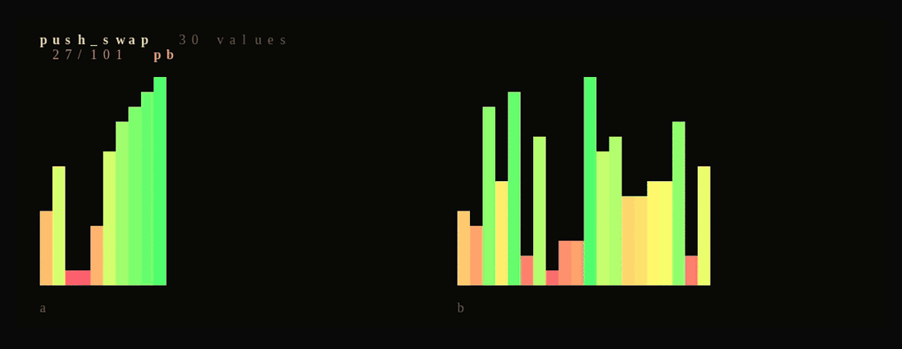

### `$ whoami`
maths & software engineering student in Paris. 42 (Master) + pure maths. Building at the intersection of low-level systems, hardware and AI.

# Projects

## Low-level & Systems

| [philosophers](https://github.com/kabylesystem/philosophers) | [push_swap](https://github.com/kabylesystem/push_swap) |
|:---:|:---:|
|  |  |
| The dining philosophers: threads, mutexes, nobody starves. `C` | Sorting a stack with a minimal number of operations. `C` |

## Web & Tools

| [piscine-exam-trainer](https://piscine-exe.vercel.app) |
|:---:|
|  |
| 42 exam simulator: 78 auto-graded C exercises, in-browser compile. `Shell` |

---

### Language & Framework

### Tools

More projects going up here as each one gets its own demo GIF: king-kusaila, senscritique-mcp, tiwizi, skillscope, miniRT, fract-ol, minitalk, Echo, alidoner-bot.
