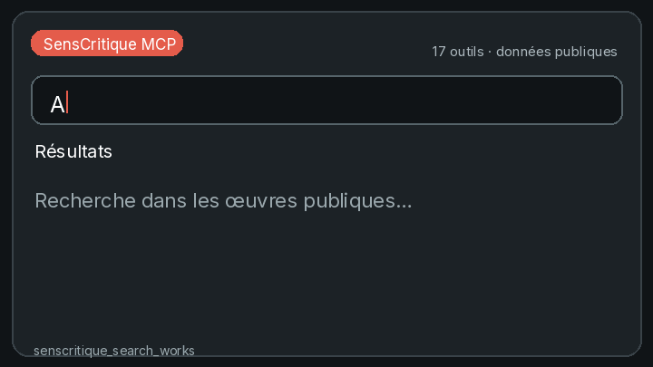
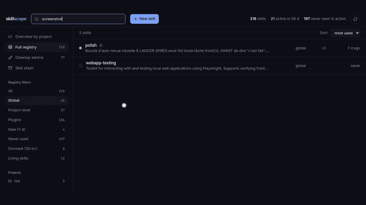
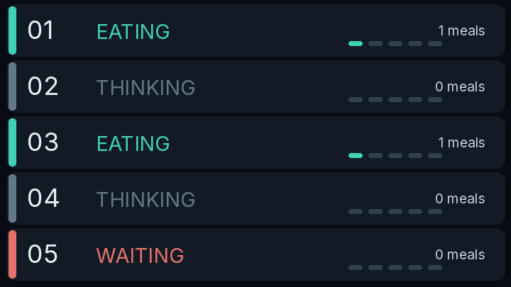

### `$ whoami`

I build agent systems and products. Neurotech Club (BCI) in Paris; mathematics, physics and low-level work at 42.

# Projects

## Products

| [Cizo](https://github.com/kabylesystem/cizo) | [EntropyOS](https://github.com/kabylesystem/entropyos) |
|:---:|:---:|
|  |  |
| CRM, VIP filters and salon agenda. Demo data. `React Native` | PDF import, exercise plans and adaptive revision. Demo data. `Next.js` |

## Agents & MCP

| [senscritique-mcp](https://github.com/kabylesystem/senscritique-mcp) | [skillscope](https://github.com/kabylesystem/skillscope) |
|:---:|:---:|
|  |  |
| 17 tools to use SensCritique through an AI. `TypeScript` | See which agent skills actually get used. `TypeScript` |

## Low-level & Systems

| [Stack Sorting](https://github.com/kabylesystem/push_swap) | [Dining Philosophers](https://github.com/kabylesystem/philosophers) |
|:---:|:---:|
|  |  |
| 200 values sorted in 1,497 moves. `C` | Five threads sharing five forks. `C` |

Sorting visualization inspired by [o-reo’s push_swap visualizer](https://github.com/o-reo/push_swap_visualizer).

---

### Languages & Frameworks

### Tools

[More projects →](https://nabtiylan.com)
