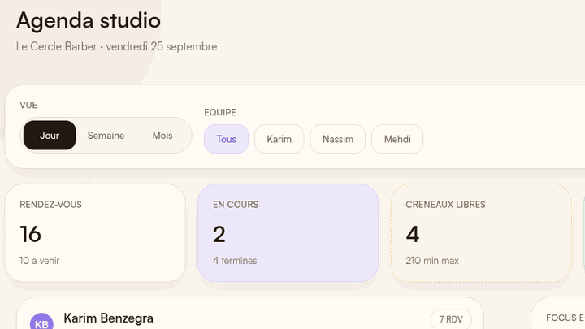
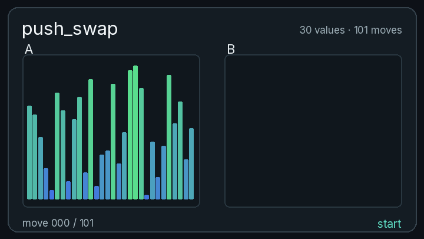

### `$ whoami`

I build agent systems and products. Neurotech Club (BCI) in Paris; mathematics, physics and low-level work at 42.

# Projects

## Products

| Cizo | [EntropyOS](https://www.entropyos.fr) |
|:---:|:---:|
|  |  |
| Salon agenda, clients and follow-ups. `React Native` | Study planning from STEM exercises. `Next.js` |

## Agents & MCP

| [senscritique-mcp](https://github.com/kabylesystem/senscritique-mcp) | [skillscope](https://github.com/kabylesystem/skillscope) |
|:---:|:---:|
|  |  |
| 17 tools to use SensCritique through an AI. `TypeScript` | See which agent skills actually get used. `TypeScript` |

## Low-level & Systems

| [push_swap](https://github.com/kabylesystem/push_swap) | [philosophers](https://github.com/kabylesystem/philosophers) |
|:---:|:---:|
|  |  |
| 30 values sorted in 101 moves. `C` | Five threads, forks and mutexes. `C` |

---

### Languages & Frameworks

### Tools

[More projects →](https://nabtiylan.com)
