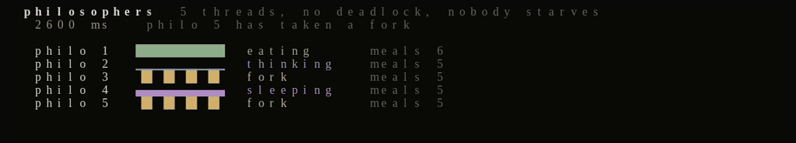

### `$ whoami`
maths & software engineering student in Paris. 42 (Master) + pure maths. Building at the intersection of low-level systems, hardware and AI.

# Projects

## AI & Agents

| [king-kusaila](https://github.com/kabylesystem/king-kusaila) | [senscritique-mcp](https://github.com/kabylesystem/senscritique-mcp) |
|:---|:---|
| A laptop operated by voice: dictation and agent-run missions, end to end. `Shell` | Unofficial MCP server to drive SensCritique from an AI. `TypeScript` |

| [Echo](https://github.com/kabylesystem/voice-hackathon-) | [alidoner-bot](https://github.com/kabylesystem/alidoner-bot) |
|:---|:---|
| A real-time neural voice interface (Activate Your Voice hackathon). `Python` | A daily AI-news digest bot for Telegram. `Python` |

## Low-level & Systems

  

| [philosophers](https://github.com/kabylesystem/philosophers) | [push_swap](https://github.com/kabylesystem/push_swap) |
|:---|:---|
| The dining philosophers: threads, mutexes, nobody starves. `C` | Sorting a stack with a minimal number of operations. `C` |

| [minitalk](https://github.com/kabylesystem/minitalk) | [libft](https://github.com/kabylesystem/libft) |
|:---|:---|
| Client-server data exchange using only UNIX signals. `C` | A from-scratch C standard library. `C` |

## Graphics

| [miniRT](https://github.com/kabylesystem/miniRT) | [fract-ol](https://github.com/kabylesystem/fract-ol) |
|:---|:---|
| A 3D raytracing renderer from scratch in C. `C` | A fractal explorer: Mandelbrot, Julia, pixel by pixel. `C` |

## Web & Tools

  

| [piscine-exam-trainer](https://piscine-exe.vercel.app) | [tiwizi](https://github.com/kabylesystem/tiwizi) |
|:---|:---|
| 42 exam simulator: 78 auto-graded C exercises, in-browser compile. `Shell` | Learning Tamazight on 208,000 verified human sentences. `TypeScript` |

| [skillscope](https://github.com/kabylesystem/skillscope) | |
|:---|:---|
| A dashboard for which Claude Code skills you actually use. `TypeScript` | |

---

### Language & Framework

### Tools

A live GIF is being added for every project, one at a time.
