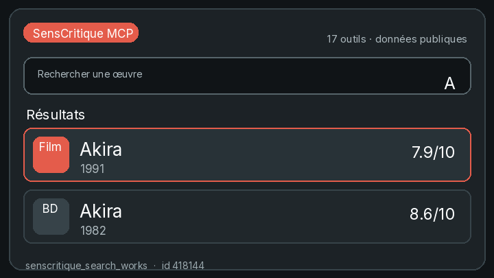
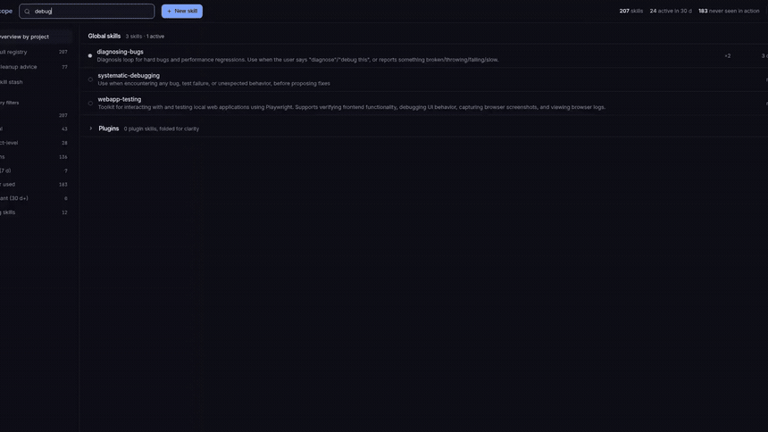

### `$ whoami`
Founder, building agent systems on LLMs. I run the Neurotech Club (BCI) in Paris, do the systems and low-level work at 42, and study mathematics and physics on my own. Drawn to anything that runs close to the metal: agents, hardware, physical AI.

# Projects

## Agents & MCP

| [senscritique-mcp](https://github.com/kabylesystem/senscritique-mcp)  |
|:---:|
|  |
| An MCP server for SensCritique: 17 tools an AI can call. Public reads work with no account, and once you log in it can rate a film, mark it watched, or save a review draft. Ships an HTTP API too, published on npm. `TypeScript` |

| [skillscope](https://github.com/kabylesystem/skillscope) |
|:---:|
|  |
| Your Claude Code skill bank, with receipts: every skill on the machine, which ones the agent actually triggers, which ones are dead weight. Local-first dashboard. `TypeScript` |

## Low-level & Systems

| [philosophers](https://github.com/kabylesystem/philosophers) | [push_swap](https://github.com/kabylesystem/push_swap) |
|:---:|:---:|
|  |  |
| The dining philosophers: threads, mutexes, nobody starves. `C` | Sorting a stack with a minimal number of operations. `C` |

## Web & Tools

| [piscine-exam-trainer](https://piscine-exe.vercel.app) |
|:---:|
|  |
| 42 exam simulator: 78 auto-graded C exercises, in-browser compile. `Shell` |

---

### Language & Framework

### Tools

More going up here as each one gets its own demo: king-kusaila (a laptop run by voice), tiwizi, EntropyOS, miniRT, Echo, alidoner-bot. Everything else lives at <a href="https://nabtiylan.com">nabtiylan.com</a>.
