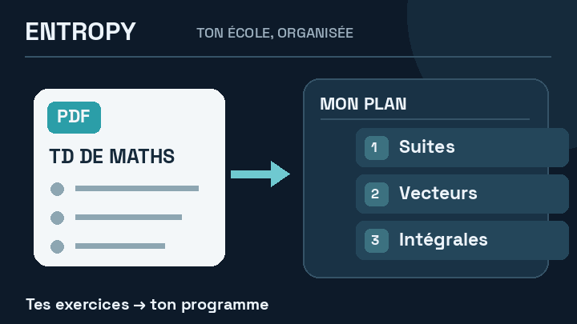
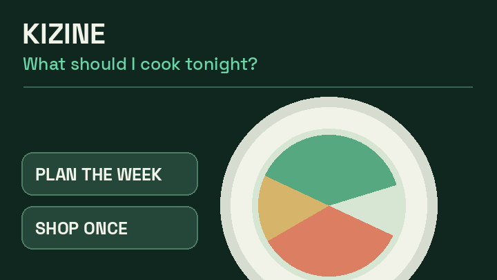
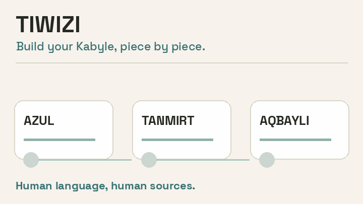
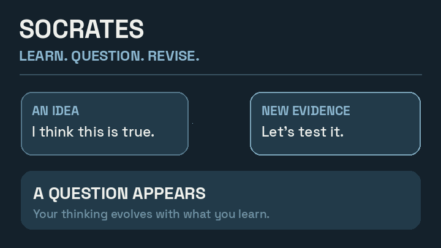
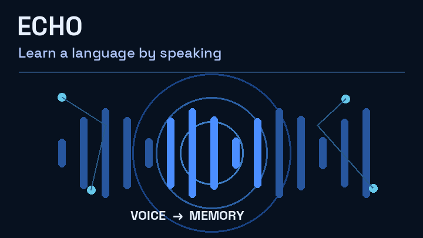
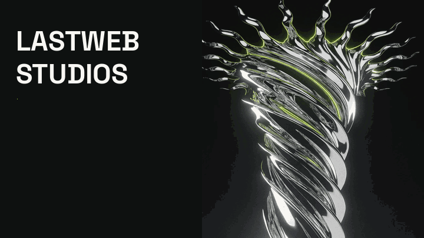
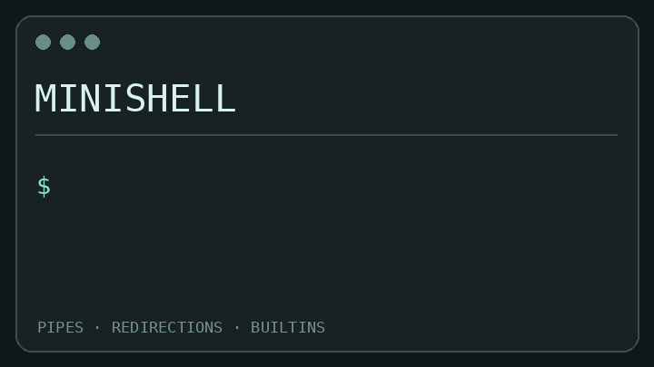

### `$ whoami`

I build agent systems and products. Neurotech Club (BCI) in Paris; mathematics, physics and low-level work at 42.

# Projects

## Products

<table width="100%">
  <tr>
    <th width="50%" align="center"><a href="https://github.com/kabylesystem/cizo">Cizo</a></th>
    <th width="50%" align="center"><a href="https://github.com/kabylesystem/entropyos">EntropyOS</a></th>
  </tr>
  <tr>
    <td width="50%" align="center"></td>
    <td width="50%" align="center"></td>
  </tr>
  <tr>
    <td width="50%" align="center">A salon OS for bookings, clients and follow-ups. (React Native) <a href="https://cizo.app/">Visit site →</a></td>
    <td width="50%" align="center">A study OS that turns exercise sheets into a daily plan. (Next.js) <a href="https://www.entropyos.fr/">Visit site →</a></td>
  </tr>
</table>

<table width="100%">
  <tr>
    <th width="50%" align="center"><a href="https://github.com/kabylesystem/kizine">Kizine</a></th>
    <th width="50%" align="center"><a href="https://github.com/kabylesystem/tiwizi">Tiwizi</a></th>
  </tr>
  <tr>
    <td width="50%" align="center"></td>
    <td width="50%" align="center"></td>
  </tr>
  <tr>
    <td width="50%" align="center">Plan meals, shop once and decide what to cook. (Next.js, SQLite)</td>
    <td width="50%" align="center">Learn Kabyle through words, sentences and guided practice. (Next.js, TypeScript)</td>
  </tr>
</table>

## Learning & Agents

<table width="100%">
  <tr>
    <th width="50%" align="center"><a href="https://github.com/kabylesystem/socrates-open">Socrates</a></th>
    <th width="50%" align="center"><a href="https://github.com/kabylesystem/voice-hackathon-">Echo</a></th>
  </tr>
  <tr>
    <td width="50%" align="center"></td>
    <td width="50%" align="center"></td>
  </tr>
  <tr>
    <td width="50%" align="center">Question what you learn and track how your thinking changes. (Next.js, SQLite)</td>
    <td width="50%" align="center">Learn a language by speaking with an AI tutor. (React, Three.js, FastAPI)</td>
  </tr>
</table>

<table width="100%">
  <tr>
    <th width="50%" align="center"><a href="https://github.com/kabylesystem/senscritique-mcp">senscritique-mcp</a></th>
    <th width="50%" align="center"><a href="https://github.com/kabylesystem/skillscope">skillscope</a></th>
  </tr>
  <tr>
    <td width="50%" align="center"></td>
    <td width="50%" align="center"></td>
  </tr>
  <tr>
    <td width="50%" align="center">Films, books and reviews from SensCritique in your AI assistant. (TypeScript, MCP)</td>
    <td width="50%" align="center">A dashboard to see which agent skills you actually use. (TypeScript)</td>
  </tr>
</table>

## Studio & Systems

<table width="100%">
  <tr>
    <th width="50%" align="center"><a href="https://github.com/kabylesystem/lastwebstudios-showcase">LastWebStudios</a></th>
    <th width="50%" align="center"><a href="https://github.com/bruno-lamotte/minishell">Minishell</a></th>
  </tr>
  <tr>
    <td width="50%" align="center"></td>
    <td width="50%" align="center"></td>
  </tr>
  <tr>
    <td width="50%" align="center">Websites and the systems that bring clients to them, built end to end. (Design, automation, operations) <a href="https://lastwebstudios.com/">Visit site →</a></td>
    <td width="50%" align="center">A working Unix shell, built with <a href="https://github.com/bruno-lamotte">Bruno Lamotte</a>. (C)</td>
  </tr>
</table>

## Low-level

<table width="100%">
  <tr>
    <th width="50%" align="center"><a href="https://github.com/kabylesystem/push_swap">Stack Sorting</a></th>
    <th width="50%" align="center"><a href="https://github.com/kabylesystem/philosophers">Philosophers</a></th>
  </tr>
  <tr>
    <td width="50%" align="center"></td>
    <td width="50%" align="center"></td>
  </tr>
  <tr>
    <td width="50%" align="center">Watch numbers get sorted using only two stacks. (C)</td>
    <td width="50%" align="center">Five philosophers share five forks without getting stuck. (C, threads)</td>
  </tr>
</table>

Sorting visualization inspired by [o-reo’s push_swap visualizer](https://github.com/o-reo/push_swap_visualizer).

---

### Languages & Frameworks

### Tools

[More projects →](https://nabtiylan.com)
